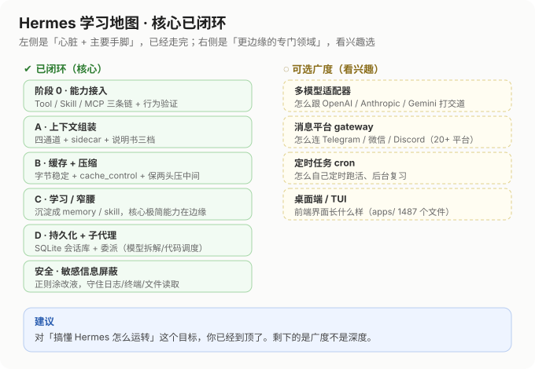

# Hermes 学习地图 · 核心已闭环

## 已闭环（核心）

| 阶段 | 主题 | 一句话 |
|---|---|---|
| 阶段 0 | 能力接入 | Tool / Skill / MCP 三条链 + 行为验证 |
| A | 上下文组装 | 四通道 + sidecar + 说明书三档 |
| B | 缓存 + 压缩 | 字节稳定 + cache_control + 保两头压中间 |
| C | 学习 / 窄腰 | 沉淀 memory / skill，核心极简、能力在边缘 |
| D | 持久化 + 子代理 | SQLite 会话库 + 委派（模型拆解 / 代码调度） |
| 安全 | 敏感信息屏蔽 | 正则涂改液，守住日志 / 终端 / 文件读取 |

## 可选广度（看兴趣，非必学）

- 多模型适配器 —— 怎么跟 OpenAI / Anthropic / Gemini 打交道
- 消息平台 gateway —— 怎么连 Telegram / 微信 / Discord（20+ 平台）
- 定时任务 cron —— 怎么自己定时跑活、后台复习
- 桌面端 / TUI —— 前端界面长什么样（apps/ 1487 个文件）

## 建议

对「搞懂 Hermes 怎么运转」这个目标，核心已经到顶，剩下的是广度不是深度。下一步建议实战 `/learn`、装 skill，或拿「窄腰 + 字节稳定 + sidecar」这套尺子横向对比其他 agent 框架。

---

详细笔记见 `源码学习笔记.md`，复习清单见 `复习大纲.md`。
